# 🤖 AITechAPIProject

AITech, yapay zeka destekli içerik üretimi, kurumsal web yönetimi ve modern yazılım mimarisi prensipleriyle geliştirilmiş çok katmanlı bir ASP.NET Core Web API + MVC projesidir.

Bu proje; Admin panel, API katmanı ve Web UI olmak üzere ayrılmış yapısıyla, ölçeklenebilir ve sürdürülebilir bir mimari sunar.

## 📖 Proje Hakkında

AITechAPIProject, yapay zeka destekli içerik üretimi ve kurumsal web site yönetimi amacıyla geliştirilmiş,
ASP.NET Core tabanlı, çok katmanlı bir yazılım projesidir. Proje; API, iş katmanı ve kullanıcı arayüzü
ayrımıyla modern yazılım mimarisi prensiplerine uygun olarak tasarlanmıştır.

Admin panel üzerinden yönetilen içerikler, yapay zeka entegrasyonu sayesinde dinamik olarak
oluşturulabilmekte ve web sitesine uygun, kurumsal formatta sunulmaktadır. Bu yapı, hem yönetilebilirliği
artırmakta hem de içerik üretim süreçlerini hızlandırmaktadır.

AITechAPIProject, ölçeklenebilir mimarisi, temiz kod yaklaşımı ve RESTful API yapısıyla; yapay zekayı
gerçek bir web projesinde kullanmak isteyen geliştiriciler için örnek bir uygulama niteliğindedir.

## 🚀 Proje Özellikleri

| Özellik | Açıklama |
|------|---------|
| Yapay Zeka Entegrasyonu | About, Services, FAQ gibi içeriklerin AI ile üretilmesi |
| Admin Panel | İçerik ve sayfa yönetimi |
| RESTful API | Tüm CRUD işlemleri API üzerinden |
| Modern UI | Responsive ve kullanıcı dostu arayüz |
| Katmanlı Mimari | API, Business, DataAccess, DTO, Entity, WebUI |
| Temiz Kod | SOLID prensiplerine uygun yapı |

## 🖥️ Kullanılan Teknolojiler

| Katman | Teknoloji | Açıklama |
|------|-----------|----------|
| Backend | ASP.NET Core Web API | RESTful API geliştirme |
| Backend | Entity Framework Core | ORM ve veritabanı işlemleri |
| Backend | Mapster | DTO ve Entity dönüşümleri |
| Backend | Dependency Injection | Bağımlılık yönetimi |
| Frontend | ASP.NET Core MVC | Web kullanıcı arayüzü |
| Frontend | Bootstrap 5 | Responsive ve modern tasarım |
| Frontend | Owl Carousel | Slider ve carousel bileşenleri |
| Frontend | WOW.js | Scroll animasyonları |
| Frontend | Font Awesome / Bootstrap Icons | İkon setleri |

## 📸 Ekran Görüntüleri

### 🌐 Anasayfa & Kullanıcı Arayüzü

#### 🏠 Anasayfa

#### ℹ️ Hakkımızda Sayfası
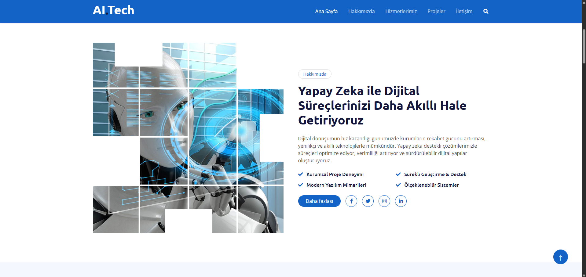

#### 🧠 Hizmetler
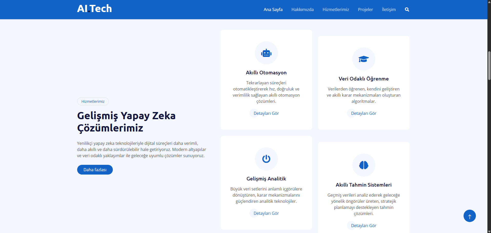

#### ⭐ Neden Bizi Seçmelisiniz
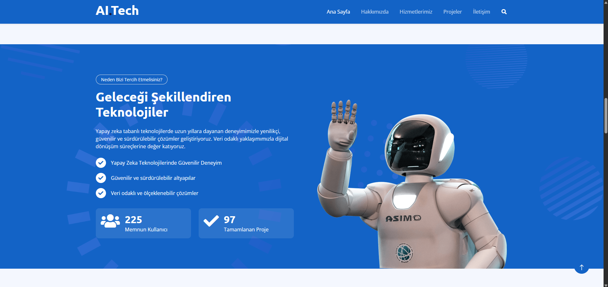

#### 📂 Projeler
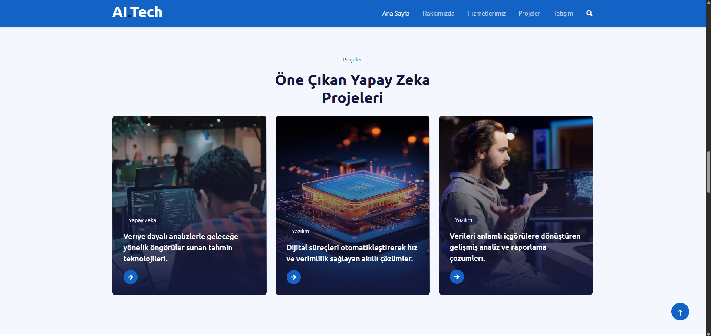

#### 👥 Ekip
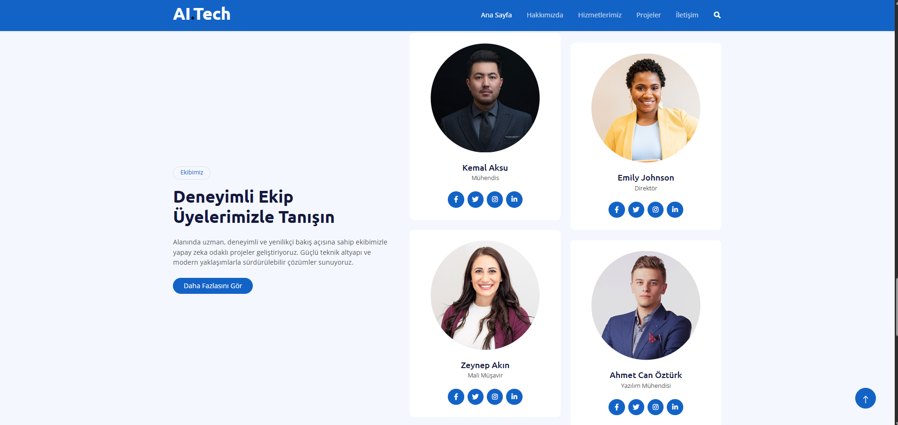

#### 💬 Referanslar
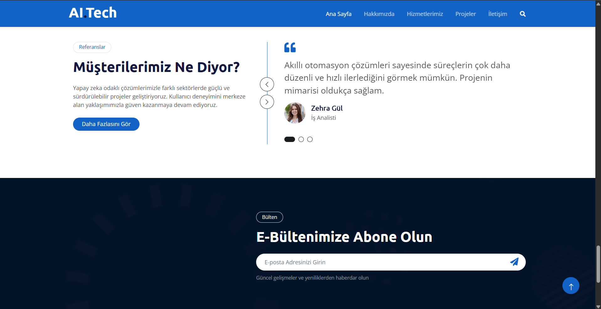

#### ❓ Sıkça Sorulan Sorular

---

### 🛠️ Yönetici Paneli (Admin)

#### ⚙️ Admin – Hakkımızda Yönetimi
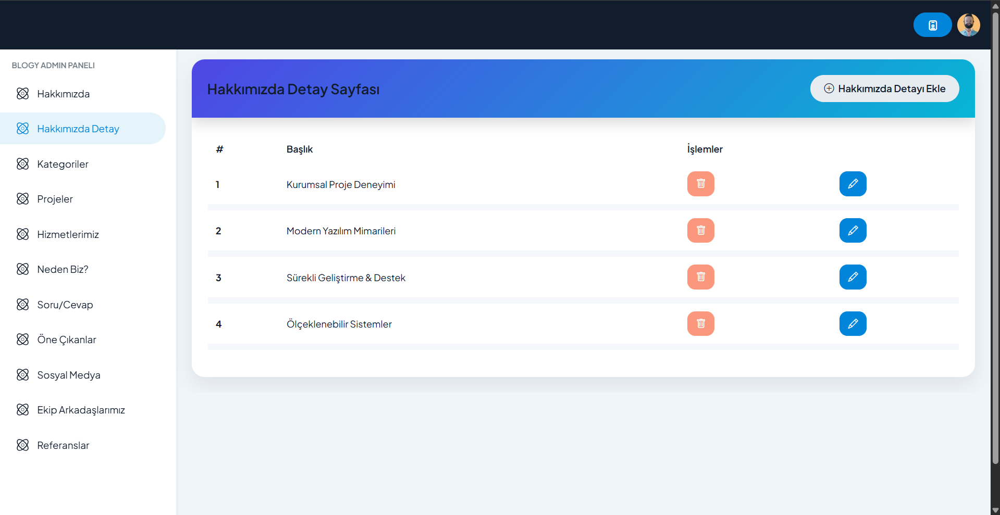

#### 🤖 Admin – Yapay Zeka İçerik Üretimi
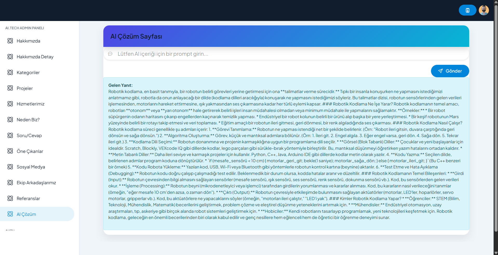

#### 📊 Admin – Proje Yönetimi
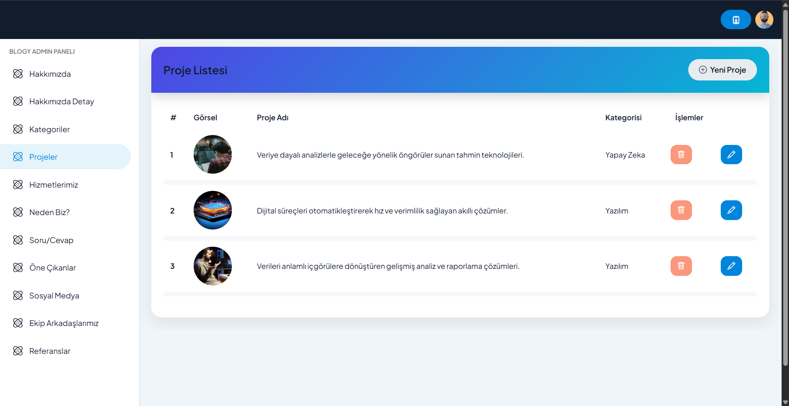

#### 🌐 Admin – Sosyal Medya Yönetimi
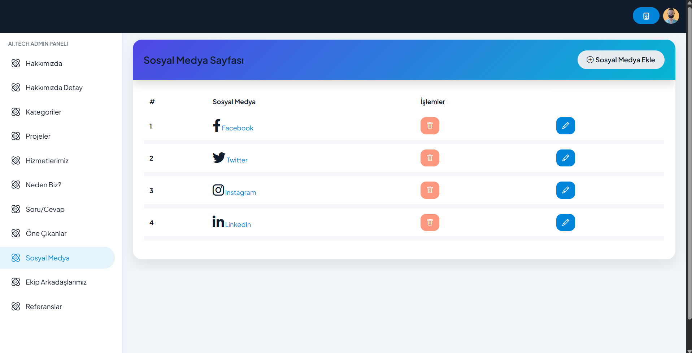

#### 👤 Admin – Ekip Yönetimi
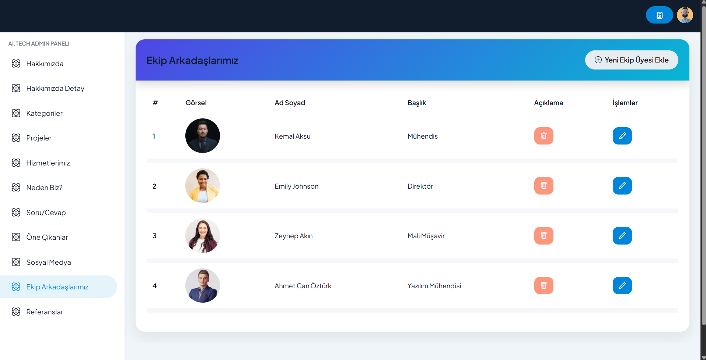

#### 🗣️ Admin – Referans & Yorum Yönetimi
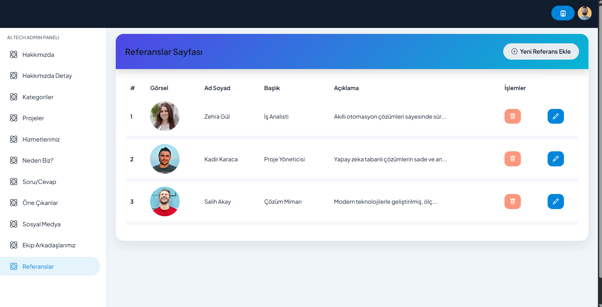

